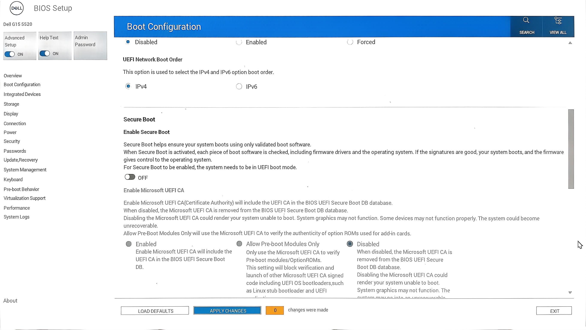
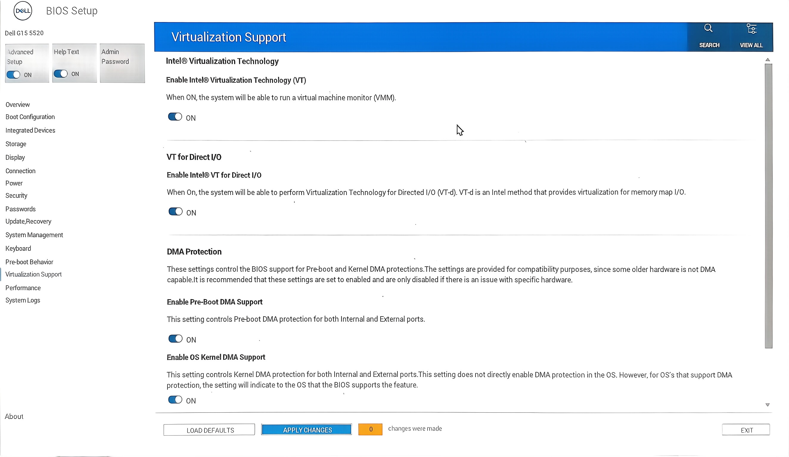
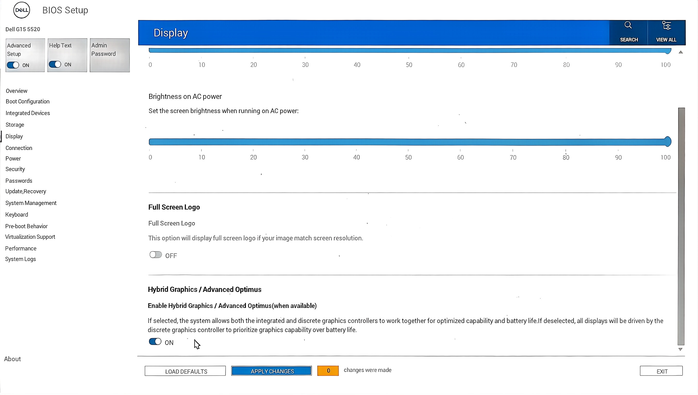

# KVM 虚拟机

> By WuDiXianXin

## BIOS 设置

### 一、关闭安全启动

关闭 Secure Boot



### 二、虚拟化支持

开启 VT、VT-d



### 三、开启混显




## 安装 KVM

### 一、检查硬件支持

#### 虚拟化支持检测

```bash
LC_ALL=C.UTF-8 lscpu | grep Virtualization
grep -E --color=auto 'vmx|svm|0xc0f' /proc/cpuinfo  # 直接检测CPU虚拟化标志
lsmod | grep kvm                                  # 验证内核模块是否加载
```

#### 若 lsmod 无输出，需手动加载模块

```bash
# 二选一
sudo modprobe kvm_intel  # Intel CPU
sudo modprobe kvm_amd    # AMD CPU
```

### 二、安装必要软件包

#### 安装核心组件

```bash
paru -S qemu-desktop libvirt virt-manager virt-viewer \
dmidecode dnsmasq openbsd-netcat edk2-ovmf swtpm
```

#### 各包的作用及重要性

1. **核心必需包（不可缺少）**：
   - `qemu-desktop`：KVM 依赖的虚拟化核心引擎，提供虚拟机运行环境。
   - `libvirt`：管理虚拟化平台的 API 和工具，是 `virt-manager` 等工具的基础。
   - `virt-manager`：图形化虚拟机管理工具，日常操作的主要界面。
   - `virt-viewer`：用于连接和显示虚拟机的图形界面（如 VNC 连接）。
   - `dnsmasq`：为虚拟机提供 DNS 和 DHCP 服务（默认虚拟网络依赖）。
   - `edk2-ovmf`：提供 UEFI 固件支持，现代虚拟机启动（尤其 Windows 虚拟机）依赖。

2. **网络相关重要包（建议保留）**：
   - `openbsd-netcat`：提供网络工具（如端口转发测试、虚拟机网络调试）。

3. **相对不重要的包**：
   - **`dmidecode`**：
     功能是读取硬件的 DMI（桌面管理接口）信息（如主板型号、BIOS 版本等）。
     对 KVM 核心功能（创建、运行、管理虚拟机）**无直接影响**，仅在少数场景下有用（如虚拟机需要模拟特定硬件信息时辅助调试）。
     即使不安装，也不会影响 KVM 的正常使用。
   - `swtpm`：
     TPM（可信平台模块）模拟工具。如果你需要安装 Windows 11，务必安装此包，否则会因缺少 TPM 2.0 而导致安装失败；其他虚拟机场景可视为可选。

### 三、配置服务与用户权限

#### 配置 libvirt 规则

```bash
sudo nano /etc/polkit-1/rules.d/50-libvirt.rules
```

```js
/* 允许 kvm 组成员无需认证管理 libvirt */
polkit.addRule(function(action, subject) {
    if (action.id == "org.libvirt.unix.manage" &&
        subject.local && subject.active &&
        subject.isInGroup("kvm")) {
        return polkit.Result.YES;
    }
});
```

```bash
sudo chown root:polkitd /etc/polkit-1/rules.d/50-libvirt.rules
sudo chmod 644 /etc/polkit-1/rules.d/50-libvirt.rules
```

#### 配置 Libvirt 权限（可选）

```bash
sudo nvim /etc/libvirt/libvirtd.conf
```

```ini
unix_sock_group = "libvirt"
unix_sock_rw_perms = "0770"
```

#### 将用户加入必要用户组

```bash
sudo usermod -aG libvirt,kvm $(whoami)
# 完成后需 重新登录(或重启) 或执行 newgrp libvirt 使配置生效
```

#### 重启系统

重新登录或重启计算机，确保用户组权限生效。

#### 配置开机自启动服务

```bash
# 不要开机自启 dnsmasq 服务，
# 因为 libvirt 在创建和开启虚拟机时自动实例化一个 dnsmasq 进程
sudo systemctl enable --now libvirtd
```

#### 开启NAT default网络

```bash
sudo virsh net-start default
sudo virsh net-autostart default
```

## 四、启动

### 使用图形化工具（推荐）

```bash
# 启动 virt-manager
virt-manager
```

## 热切换显卡直通

[参考 林长枫Shorin709 的配置](https://github.com/SHORiN-KiWATA/Shorin-ArchLinux-Guide/wiki/%E7%83%AD%E5%88%87%E6%8D%A2%E6%98%BE%E5%8D%A1%E7%9B%B4%E9%80%9A)

### 开启显卡直通

#### 开启混显

前面说了，这里不做赘述。

#### 查找nvidia的drm文件名(设备)

```bash
ls -l /sys/class/drm/card*/device/driver
ls -l /sys/class/drm/render*/device/driver
```

我这里基本上都是 card0 和 renderD129

#### 关闭n卡上的所有进程

##### 查找n卡上的所有进程

```bash
sudo fuser -v /dev/nvidia*
sudo fuser -v /dev/dri/card0
sudo fuser -v /dev/dri/renderD129
```

##### 关闭这些进程

###### 关闭niri 

在 niri 的 config.kdl 中添加以下内容，然后重启 niri-session

```kdl
debug {
    // 不使用 N 卡
    ignore-drm-device "/dev/dri/renderD129"
}
```

###### 关闭所有使用nvidia的程序

```bash
sudo fuser -k -9 /dev/nvidia*
```

#### 移除nvidia的所有模块

```bash
sudo rmmod nvidia_drm
sudo rmmod nvidia_modeset
sudo rmmod nvidia_uvm
sudo rmmod nvidia
```

#### 解绑驱动

##### 确认和n卡同iommu组的PCI地址

```bash
bash -c 'for d in /sys/kernel/iommu_groups/*/devices/*; do 
      n=${d#*/iommu_groups/*}; n=${n%%/*}
      printf \'IOMMU Group %s \' "$n"
      lspci -nns "${d##*/}"
done'
```

输出如下所示，请你根据你自己的进行标记

```text
IOMMU **Group 13 01:00.0** VGA compatible controller [0300]: **NVIDIA** Corporation GA106M [GeForce RTX 3060 Mobile / Max-Q] [10de:2560] (rev a1)
IOMMU **Group 13 01:00.1** Audio device [0403]: **NVIDIA** Corporation GA106 High Definition Audio Controller [10de:228e] (rev a1)
```

##### 查询驱动

```bash
lspci -Dk
```

```text
**0000:01:00.0** VGA compatible controller: NVIDIA Corporation GA106M [GeForce RTX 3060 Mobile / Max-Q] (rev a1)
	Subsystem: Dell Device 0b56
	Kernel driver in use: **nvidia**
	Kernel modules: nouveau, nvidia_drm, nvidia
**0000:01:00.1** Audio device: NVIDIA Corporation GA106 High Definition Audio Controller (rev a1)
	Subsystem: NVIDIA Corporation Device 0000
	Kernel driver in use: **snd_hda_intel**
	Kernel modules: snd_hda_intel
```

##### 从驱动解绑

```bash
# 这里也许会报错，因为前面已经`rmmod nvidia`之后可能已经解绑了。
echo "0000:01:00.0" | sudo tee /sys/bus/pci/drivers/nvidia/unbind

# 解绑音频模块驱动
echo "0000:01:00.1" | sudo tee /sys/bus/pci/drivers/snd_hda_intel/unbind 
```

##### 让vfio接管

```bash
# 加载vfio模块
sudo modprobe vfio-pci

# 覆盖驱动为vfio
echo "vfio-pci" | sudo tee /sys/bus/pci/devices/0000:01:00.0/driver_override
echo "vfio-pci" | sudo tee /sys/bus/pci/devices/0000:01:00.1/driver_override

# 重新扫描设备绑定vfio
echo "0000:01:00.0" | sudo tee /sys/bus/pci/drivers_probe
echo "0000:01:00.1" | sudo tee /sys/bus/pci/drivers_probe
```

检测

```bash
lspci -k | grep -A 2 -i nvidia
```

### 热切换内存大页

默认的内存大页是2MB

#### 释放缓存和清理内存碎片

```bash
sudo sync
echo 3 | sudo tee /proc/sys/vm/drop_caches
echo 1 | sudo tee /proc/sys/vm/compact_memory
```

#### 分配内存大页

```bash
# 分配 4096 个 2MB 大页（共 8GB）
sysctl -w vm.nr_hugepages=4096
```

#### 确认是否成功

```bash
cat /proc/sys/vm/nr_hugepages
```

#### 修改虚拟机xml

```xml
<memoryBacking>
    <hugepages>
</memoryBacking>
```

### 关闭显卡直通

#### 确认显卡直通虚拟机已经关闭

一定要关，不然可能会卡死。

#### 解绑vfio

```bash
# 移除驱动覆盖
echo "" | sudo tee /sys/bus/pci/devices/0000:01:00.0/driver_override
echo "" | sudo tee /sys/bus/pci/devices/0000:01:00.1/driver_override

# 解绑vfio
echo "0000:01:00.0" | sudo tee /sys/bus/pci/drivers/vfio-pci/unbind
echo "0000:01:00.1" | sudo tee /sys/bus/pci/drivers/vfio-pci/unbind
```
#### 重新加载nvidia模块

```bash
sudo modprobe nvidia
sudo modprobe nvidia_drm
sudo modprobe nvidia_modeset
sudo modprobe nvidia_uvm
```

#### 重新检测，激活显卡

```bash
echo "0000:01:00.0" | sudo tee /sys/bus/pci/drivers_probe
echo "0000:01:00.1" | sudo tee /sys/bus/pci/drivers_probe
```

#### 释放内存大页

```bash
sysctl -w vm.nr_hugepages=0
cat /proc/sys/vm/nr_hugepages
```
