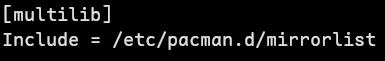

> 配置Arch Linux，by RuoChen404
---
# 配置系统
### 重启后登录root账户，方便配置
### 连接网络
1. 使用ping命令查看是不是连接到网络了
```bash
ping -c 4 www.baidu.com
```
2. 如果未连接网络，使用 NetworkManager 的工具 nmcli
    1. 启动 NetworkManager 服务，并连接wifi
    ```bash
    sudo systemctl enable --now NetworkManager
    nmcli --ask device wifi connect wifi的名字
    ```
    2. 如果以上无法使用，则
        1. 查看当前可用的网络连接和设备状态
        ```bash
        nmcli device
        ```
        ```
        DEVICE  TYPE      STATE        CONNECTION
        wlan0   wifi      disconnected --
        eth0    ethernet  unavailable  --
        lo      loopback  unmanaged    --
        ```
        ```bash
        ip link
        ```
            从输出结果找到有wlp的
        ```
        ......
        3: wlp0s20f3 ......
        ```
        2. 添加新的 Wi-Fi 连接（如果尚未创建，记得去掉所有 '[ ]' ）
		nmcli connection add type wifi con-name "[自定义虚拟网卡名字]" ifname [wlp0s20f3] autoconnect yes ssid [wifi的名字] wifi-sec.key-mgmt [一般情况填wpa-psk] wifi-sec.psk [wifi的密码]
        3. 激活 Wi-Fi 连接
        ```bash
		nmcli connection up "[自定义虚拟网卡名字]"
	    ```
        4. 检查连接状态，确认是否成功连接
        ```bash
		nmcli connection show "[自定义虚拟网卡名字]"
	    ```
        5. 使用 ping 命令测试网络连接
        ```bash
  		ping -c 4 www.baidu.com
	    ```
### 安装aur助手paru与日常维护
1. 配置Arch Linux CN 仓库
```bash
nano /etc/pacman.conf
```
    写入文件的末尾（可以添加离你近的，也可以写多个 Server，但是两个就够用了）：
```
[archlinuxcn]
Server = https://mirrors.tuna.tsinghua.edu.cn/archlinuxcn/$arch
```
    保存退出（或者填写第一个镜像站的）
2. 更新包数据库 并 安装 archlinuxcn-keyring
```bash
pacman -Sy archlinuxcn-keyring
```
3. 安装 AUR助手 paru：
```bash
pacman -Sy paru
```
4. 日常维护，只需要：这其中参数：y会自动更新包数据库，u升级系统中的包
```bash
sudo pacman -Syu
```
5. 半年或者几个月后进行一次更新密钥
```bash
sudo pacman -S archlinux-keyring archlinuxcn-keyring
```
6. 如果日后出现密钥错误问题，重新初始化密钥环
```bash
sudo rm -fr /etc/pacman.d/gnupg
sudo pacman-key --init
sudo pacman-key --populate archlinux
sudo pacman-key --populate archlinuxcn
```
### 安装N卡驱动（nvidia-dkms版）
(我们事先安装了base base-devel linux linux-firmware linux-headers)
前置要求： base-devel linux-headers
1. 启用32位包，可以玩32位游戏，也是 lib32-nvidia-utils 包的前置要求
    需要先***取消注释*** /etc/pacman.conf 文件 的下面两行（在文件内容最下面附近）
    
```bash
nano /etc/pacman.conf
```
2. 安装 dkms 和 nvidia-dkms以及相应工具和包
```bash
pacman -S dkms nvidia-dkms nvidia-utils nvidia-settings nvidia-prime lib32-nvidia-utils
```
3. 注意事项：
    (不要安装nvidia这个包，也不需要其他几个包nvidia-（drm、modeset、uvm），
    因为nvidia-dkms已经包含了这些)
4. 重启
```bash
reboot
```
### 安装字体
1. noto 字体：
```bash
# pacman -S noto-fonts noto-fonts-cjk noto-fonts-emoji noto-fonts-extra
pacman -S ttf-nerd-fonts-symbols noto-fonts-emoji
```
2. Maple Mono Normal NF CN 字体:
  (仓库里面有，放在/usr/share/fonts/目录中)

3. awesome 字体:
```bash
pacman -S ttf-font-awesome
```
4. 刷新字体
```bash
fc-cache -fv
```
### 安装终端模拟器（桌面环境需要）
安装并配置kitty 或者 foot
```bash
pacman -S kitty
mkdir -p ~/.config/kitty
nano ~/.config/kitty/kitty.conf
```
  输入内容，保存退出：
```
font_family Maple Mono Normal NF CN
font_size 12
encoding utf-8
pango_markup yes
```
### 安装桌面环境以及一些软件

(我安装的是 hyprland)
```bash
paru -S \
hyprland \
hyprland-qt-support \
pango \
kitty \
foot \
fuzzel \
swaync \
waybar \
qt5-base \
qt6-base \
qt5-tools \
qt6-tools \
qt5-wayland \
qt6-wayland \
gtk3 \
gtk4 \
xdg-utils \
xdg-desktop-portal-hyprland \
xdg-desktop-portal-gtk \
kde-gtk-config \
flameshot \
fcitx5-im \
fcitx5-chinese-addons \
fcitx5-pinyin-zhwiki \
rime-pinyin-zhwiki \
luajit \
neovim \
eza \
fzf \
zoxide \
ripgrep \

```
### 切换到普通用户，进入桌面环境，普通用户登录，进行配置
1.开始
```bash
su [用户名]
sudo systemctl enable sddm
reboot
```
    进入sddm界面，选择hyprland（wayland）,输入密码，桌面环境。

2. (必须，hyprland.conf中有一些环境配置) 拷贝仓库配置文件

3. 再配置输入法：
```bash
fcitx5-configtool
```
XXXXXXXXXXXXXXX（待编辑，需要gif图片）
### 安装 蓝牙 和 声卡驱动 以及 nvidia环境配置
1. 蓝牙：
```bash
sudo pacman -S bluez bluez-utils blueberry
sudo systemctl enable --now bluetooth
sudo systemctl status bluetooth
```
2. 声卡：
```bash
sudo pacman -S \
sof-firmware \
alsa-utils \
alsa-firmware \
alsa-plugins \
alsa-tools \
libcamera \
pipewire \
pipewire-pulse \
pipewire-alsa \
pipewire-jack \
wireplumber
```
```bash
systemctl --user enable --now pipewire pipewire-pulse wireplumber
```
3. 重启
```bash
reboot
```

### 禁用nvidia声卡
  配置grub，如果前面没有设置，设置了可跳过
  ```bash
  sudo nano /etc/default/grub
  ```
  部分内容修改为，然后保存退出：
  ```bash
  GRUB_CMDLINE_LINUX_DEFAULT="... nvidia-drm.modeset=1 modprobe.blacklist=snd_hda_codec_hdmi"
  ```
  更新配置
  ```bash
  grub-mkconfig -o /boot/grub/grub.cfg
  reboot
  ```

### (已废弃)
调整声音 和 指定dns服务器
1. 声音
pavucontrol启动图形配置选项
（也可以不进行以下操作）
alsamixer禁用Nvidia的声音，先F5显示全部，按m键切换到禁用，→或者n键选下一个，然后循环，全部禁掉
F6选择sof-hda-dsp
2. 配置dns服务器
（可以使用nmcli 或者 在plasma设置的wifi里面进行图形化操作）
