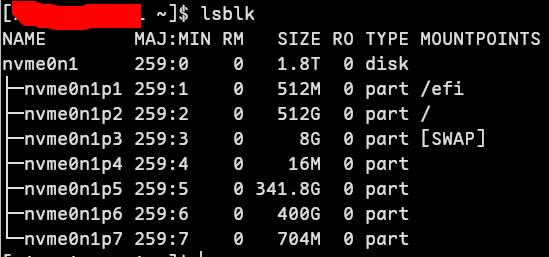
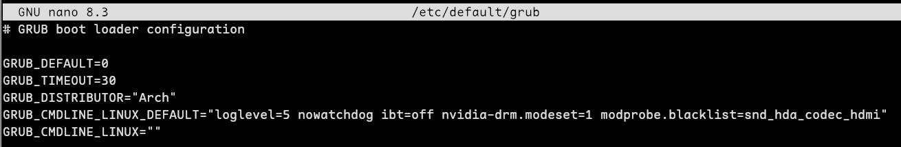

> 安装Arch Linux，by RuoChen404
> 参考文章[泠熙的博客](https://lingxi9374.github.io/posts/教程/archinst/)
---
### 进入镜像系统后，检查准备工作是否正确
1. 是否是使用UEFI启动GPT分区表的ISO镜像系统，如果有这个目录且会输出很多内容，说明是的
```bash
ls /sys/firmware/efi/efivars
```
2. 查看引导模式是不是64
```bash
cat /sys/firmware/efi/fw_platform_size
```
### 连接网络
1. 连接wifi
```bash
iwctl
device list
station wlan0 scan
station wlan0 get-networks
station wlan0 connect [wifi名称]
[wifi密码]
exit
```
2. 测试网络
```bash
ping -c 4 www.baidu.com
```
### 同步时间
1. 启用 NTP 时间同步
```bash
timedatectl set-ntp true
```
2. 查看时间配置
```bash
timedatectl status
```
### 配置镜像源
1. 使用reflector更新最近镜像站
```bash
reflector --country 'China' --age 3 --protocol https --sort rate –-save /etc/pacman.d/mirrorlist
```
2. 停止镜像列表自动更新服务（reflector）
```bash
systemctl disable --now reflector.service
```
3. 只保留前几个镜像源，比如第一个和清华源，然后保存退出
```bash
nano /etc/pacman.d/mirrorlist
```
4. 更新包数据库并安装archlinux-keyring
```bash
pacman -Sy archlinux-keyring
```
### 磁盘分区
（我这里使用的是预先留存的，不懂可以参考文章[泠熙的博客](https://lingxi9374.github.io/posts/教程/archinst/)，或者借助AI进行分区）
使用命令lsblk或者fdisk -l查看分区情况（这里是安装后的截图）

1. 格式化和挂载根目录（nvme0n1p2替换成你自己设置的）
```bash
mkdir -p /mnt
mkfs.ext4 /dev/nvme0n1p2
mount /dev/nvme0n1p2 /mnt
```
2. 格式化和挂载EFI分区（nvme0n1p1替换成你自己设置的）
```bash
mkdir -p /mnt/efi
mkfs.vfat -F32 /dev/nvme0n1p1
mount /dev/nvme0n1p1 /mnt/efi
```
3. 格式化和挂载swap分区（nvme0n1p3替换成你自己设置的）
```bash
mkswap /dev/nvme0n1p3
swapon /dev/nvme0n1p3
```
4. 查看是否挂载分区成功（会比上图多了mnt字样的）
```bash
lsblk
```
### 给新系统预装软件
1. 我的配置
pacstrap /mnt base base-devel linux linux-firmware linux-headers networkmanager dosfstools e2fsprogs ntfs-3g efibootmgr os-prober exfat-utils wget curl nano
2. 提示
如果你不需要grub中显示Windows，就不需要安装 `ntfs-3g os-prober`
### 更新信息
```bash
genfstab -U -p /mnt >> /mnt/etc/fstab
cat /mnt/etc/fstab
```
### 进入新系统
```bash
arch-chroot /mnt /bin/bash
```
### 设置主机配置
1. 设置主机名（ 'ZhuJiMing' 改成你设置的，要加一对单引号）
```bash
echo 'ZhuJiMing' > /etc/hostname
```
2. 编辑/etc/hosts文件，添加以下内容：
```bash
nano /etc/hosts
```
```bash
127.0.0.1   localhost
::1         localhost
127.0.1.1   ZhuJiMing.localdomain ZhuJiMing
```
请注意：
127.0.0.1和::1是本地回环地址，
localhost是主机名，
ZhuJiMing.localdomain是你自己设置的主机名的备用域名，
ZhuJiMing是你自己设置的主机名。
请不要修改127.0.1.1这一行，否则可能会导致网络无法正常连接。
### 设置时间
```bash
timedatectl set-ntp true
timedatectl set-timezone Asia/Shanghai
timedatectl set-local-rtc 0
timedatectl status
```
### 设置语言环境
1. ***取消注释*** en_US.UTF-8 UTF-8和zh_CN.UTF-8 UTF-8 保存退出
```bash
nano /etc/locale.gen
```
2. 更新信息
```bash
locale-gen
```
3. 设置语言环境
```bash
echo LANG=en_US.UTF-8 > /etc/locale.conf
```
### 设置账户和密码
1. 设置root账号密码（密码需要输入两次，且不显示内容）
```bash
passwd
```
2. 添加sudo用户并设置给其设置密码（'[用户名]'改成你设置的，不需要 '[ ]' ）
```bash
useradd -m -g users -G wheel [用户名]
passwd [用户名]
```
3. 开放sudo权限（删除root后面的第一个%wheel前面的#）
```bash
nano /etc/sudoers
```
### 安装微核（二选一）
1. 如果你是Intel的
```bash
pacman -S intel-ucode
```
2. 如果你是AMD的
```bash
pacman -S amd-ucode
```
### 安装并配置GRUB
1. 安装grub
（默认是安装grub2。
之前我们预装了e2fsprogs ntfs-3g efibootmgr os-prober exfat-utils，
如果你不需要grub中显示Windows，就不需要安装这些。）
```bash
pacman -S grub
```
2. 设置grub安装信息
```bash
grub-install --target=x86_64-efi --efi-directory=/efi --bootloader-id=GRUB --recheck
```
3. 配置grub内容
```bash
nano /etc/default/grub
```
- 让grub收集win系统引导（***取消注释*** 最后一行，删除’#’，如下图所示）
    
- 在启动系统时在grub界面停留30，而不是5秒
    
- 设置loglevel日志等级为3
- 不需要看门狗(防系统挂起自动重启)
- 遇到了与NVIDIA驱动不兼容的问题，添加 ibt=off 参数到内核启动参数中是推荐的解决方案。
这是因为从Linux 5.18版本开始，NVIDIA驱动可能无法在启用了间接分支跟踪（Indirect Branch Tracking，IBT）的系统上启动，
为了解决这个问题，可以设置 ibt=off 内核参数来禁用该CPU安全特性。
- 开启DRM内核级显示模式设置
- 禁用nvidia声卡
```bash
loglevel=3 nowatchdog ibt=off nvidia-drm.modeset=1 modprobe.blacklist=snd_hda_codec_hdmi
```


4. 生成grub配置文件
```bash
grub-mkconfig -o /boot/grub/grub.cfg
```
5. 检测win系统有没有加入grub选项中
```bash
os-prober
```
### 结束镜像安装
1. 退出到 ISO 镜像 root 用户环境
```bash
exit
```
2. 取消挂载分区（'[swap分区]'替换成你自己的，如 /dev/nvme0n1p3 ）
```bash
swapoff [swap分区]
umount -R /mnt/efi
umount -R /mnt
```
3. 重启
```bash
reboot
```
